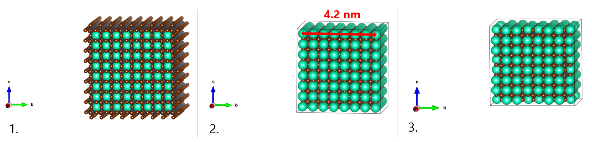

.. _build_qd:

Building a Quantum Dot Model
============================
The goal of this tutorial is to outline the steps to build a Quantum Dot (QD) model from scratch. As an example, we will build a 4.2 nm sided cubic perovskite CsPbBr\ :sub:`3`\ nanocrystal capped by 80% oleate ligands.

Installation Requirements
-------------------------
Please also note that the script requires the download and use of the Compound Attachment Tool (**CAT**) package, as well as its optional packages **data-CAT** and **nano-CAT**. We invite thus you to read the relative `documentation <https://cat.readthedocs.io/en/latest/0_documentation.html#cat-documentation>`_ before continuing this tutorial for information on their installation and available settings.

The inorganic core
------------------

The starting point to build our inorganic nanocrystal core we will be to download the Crystallographic Information File (CIF) of the cubic bulk structure of CsPbBr\ :sub:`3`\.  You can find an example of the file used in this tutorial to build the NC core `here <https://github.com/nlesc-nano/Tutorials/tree/build_qd/docs/_files/CsPbBr3_mp-600089_conventional_standard.cif>`_. This can be done from an online repository such as The Materials Project or others. The CIF file provides a precise numerical description of the crystallographic structure, and it can be downloaded from several different databases and libraries.

To create our CsPbBr\ :sub:`3`\  nanocrystal  model of about 4.2 nm in diameter, we will upload the CIF file in an appropriate visualization program (VESTA, ADF-GUI, ...) and generate an 8x8x8 supercell (see Figure, 1.). According to available experimental data combined with computational models, cubic CsPbBr\ :sub:`3`\  QDs are terminated by (100) facets with Cs and Br ions. To obtain this surface termination, we will thus cut the cubic supercell along the (100) planes, leaving Cs and Br on the surface by manually deleting the external layers in excess (see Figure, 2.).
Notice that the choice of the nanocrystal dimension is usually a trade-off between the computational cost of the follow-up calculations and the necessity of providing a realistic description, in line with experiments.

Our nanostructure now features a stoichiometry of Cs\ :sub:`512`\ Pb\ :sub:`343`\ Br\ :sub:`1176`\, corresponding to a total charge of:

.. math::
   (+1)x512 + (+2)x343 + (-1)x1176 = +22

when each ion is assumed to be in its more stable thermodynamic electronic configuration (i.e. Cs\ :sup:`+`\, Pb\ :sup:`2+`\  and Br\ :sup:`-`\).
To ensure the charge balance of our structure (*J. Phys. Chem. Lett.*, **2017**, *8*, 5209-5215), we will compensate this excess of positive charge by removing 12 Cs ions one by one, first from the corners (-8 Cs) and then from the edges (-14 Cs) of the nanocrystal surface (see Figure 3.). This choice is based on the fact that Cs ions don't participate significantly to the band edge states, so that their removal results in perovskite nanocrystal models with clean band gaps, i.e. free of midgap states. Moreover, it is known that it is energetically favorable to remove the excess ions from the corners and edges of the nanostructure and that a structure with surface vacancies is more tolerant to traps.  

Once the core is charge-balanced we will save and export the resulting .xyz into a file called ``'cspbbr3_4.2nm.xyz'``. You can find an example `here <https://github.com/nlesc-nano/Tutorials/tree/build_qd/docs/_files/cspbbr3_4.2nm.xyz>`__.

1. 8x8x8 supercell of the cubic CsPbBr\ :sub:`3`\  bulk structure.
2. Cubic CsPbBr\ :sub:`3`\  nanostructure of about 4.2 nm in side enclosed by (100) facets and terminated by Cs and Br ions.
3. Charge balanced Cs\ :sub:`490`\ Pb\ :sub:`343`\ Br\ :sub:`1176`\  nanocrystal.

Surface Anchoring Points
------------------------
Our next step is to specify where the oleate ligands will be placed at the nanocrystal surface. To do that, we will mark the desired positions of the ligands anchoring groups with dummy ions. Again, to ensure the charge neutrality if *n* oleate anions (charge -1) are to be added, *n* superficial Br\ :sup:`-`\ will be replaced by *n* dummies. Here we will build our perovskite nanocrystal capped by 80% of oleate ligands by replacing 80% of the surface Br with Cl (our dummy ion) by means of a small python script (see below). Note that the choice of naming the dummy ions as Cl is completely arbitrary. 
Let's now have a look at the script:

.. code:: python

    >>> from scm.plams import Molecule
    >>> from CAT.recipes import replace_surface
    >>> mol = Molecule('cspbbr3_4.2nm.xyz')
    >>> mol_new = replace_surface(mol, symbol='Br', symbol_new='Cl', f=0.8, mode='uniform', displacement_factor=0.7)
    >>> mol_new.write('cspbbr3_4.2nm_80Cl.xyz')
    
The script is pretty self-explanatory: the .xyz coordinates are imported from our previously-built file (``'cspbbr3_4.2nm.xyz'``). A specifically built recipe, ``replace_surface``, is then able to recognize the requested ions from their chemical symbol (``symbol='Br'``) **only** at the nanocrystal surface and replace them with dummies (``symbol_new='Cl'``) in a new .xyz file (``'cspbbr3_4.2nm_80Cl.xyz'``). Since we aim at using oleate as a ligand, we specifically chose to replace Br ions, but this setup can be varied if needed. For example, if one aims at adding cationic ligands, the Cs ions will be replaced instead.
The file also specifies the `fraction <https://cat.readthedocs.io/en/latest/4_optional.html#optional.core.subset.f>`_ of the atoms that are being replaced (80% in our case, hence the ``f=0.8`` in the script), their `distribution <https://cat.readthedocs.io/en/latest/4_optional.html#optional.core.subset.mode>`_ and the displacement factor used to recognize the surface ions (here 0.7). This latter parameter depends on the choice of the core so we suggest testing it first, as to ensure that the replacement of the surface ions by the dummies goes according to plan. (i.e. they are reasonably desplaced on the surface).

CAT input: building the Quantum Dot
-----------------------------------
We are now ready to use **CAT** to build our Quantum Dot model. We will first of all create a 'core' directory inside our working directory (see the `General Overview <https://cat.readthedocs.io/en/latest/1_get_started.html#default-settings>`_ for further information) and move our newly built .xyz file inside it.

We will then create a ``input_settings.yaml`` `input file <https://cat.readthedocs.io/en/latest/includeme.html#input-files>`_ in the working directory and customize it with the desired settings.

Let's take a look at our .yaml input:

.. code:: yaml

    path: null
    input_cores:
        - cspbbr3_4.2nm_80Cl.xyz:
            guess_bonds: False
    input_ligands:
        - CCCCCCCCC=CCCCCCCCC(=O)[O-]
    optional:
        core:
            dirname: core
            anchor: Cl
        ligand:
            dirname: ligand
            optimize: True
            split: False
        qd:
            dirname: qd
            construct_qd: True
            optimize: False
        
The `path <https://cat.readthedocs.io/en/latest/2_path.html#path>`_, `input_cores & input_ligands <https://cat.readthedocs.io/en/latest/3_input_core_ligand.html#input-cores-input-ligands>`_ and  sections, together with the meaning of the `optional <https://cat.readthedocs.io/en/latest/4_optional.html#optional>`_ keywords and their relative `arguments <https://cat.readthedocs.io/en/latest/4_optional.html#arguments>`_, can be easily found inside the **CAT** `documentation <https://cat.readthedocs.io/en/latest/0_documentation.html#cat-documentation>`_. Let's take a look at them in detail:

1. ``path``: The `path <https://cat.readthedocs.io/en/latest/2_path.html#path>`_ section, as suggested, contains the path to the so-called working directory - i.e. where all the files are stored.
2. ``input_cores``: This section contains the coordinates of the core, specified by our .xyz file (``cspbbr3_4.2nm_80Cl.xyz``). The ``guess_bonds: False`` keyword tells **CAT** that, since our core is ionic, it is not necessary the bonds and bond orders from the content of the .xyz file (i.e. it is not required to generate the internal coordinates of the system).
3. ``input_ligands``: This section contains information on both the structure and the chemistry of the ligand. This information is stored in its `SMILES <https://en.wikipedia.org/wiki/Simplified_molecular-input_line-entry_system#Description>`_ (Simplified molecular-input line-entry system) string, specifically ``CCCCCCCCC=CCCCCCCCC(=O)[O-]`` for oleate.
4. ``optional``: The `optional <https://cat.readthedocs.io/en/latest/4_optional.html#optional>`_ section contains three fairly similar subsections: ``core``, ``ligand``, ``qd``. The subsections contain keywords with several specifications, such as:

  - the directories where inorganic cores/ligands/qd will be stored (``optional.*.dirname``);
  - whether or not their optimization is required (``optional.ligand.optimize`` and ``optional.*.optimize``);
  - the dummy atom that needs to be replaced with the chosen ligand (``optional.*.anchor``)
  - whether or not to remove protons from the ligand (``optional.ligand.split``). Specifically, since the SMILES string we are using in the input (i.e. ``CCCCCCCCC=CCCCCCCCC(=O)[O-]``) refers to the anionic ligand, we will opt for ``optional.ligand.split: False``, so no protons have been removed from the ligand anchoring group. Conversely, if the SMILES is provided in the neutral form, then ``optional.ligand.split: True``, meaning that a proton is cleaved from the functional group (in this case carboxylate) to ensure that the ligand is still added in its anionic form. Note that the latter form is preferrable when the ligand present more than one functional group.  

In all cases, the ``*`` in the keywords accounts for the name of the subsection it refers to (i.e ``core``, ``ligand``, ``qd``).

We are finally ready to run CAT with the following command: ``init_cat input_settings.yaml``
After running **CAT** the .xyz file corresponding to our oleate capped perovskite nanocrystal can be found in the specified directory, 'qd'. Don't worry, the directory will be created from scratch if it does not yet exist!

An important point here is that CAT automatically browse the provided ligand for "default" functional groups - the complete list is provided `here <https://github.com/nlesc-nano/CAT/blob/master/CAT/data/templates/smiles.yaml>`__. If there is more than one present, e.g. 3, then CAT will build 3 QD models with the ligands bound from different anchoring groups. 

Rename the .xyz file, you are now ready to use it!
